# UltraFluidModelerNET

UltraFluidModelerNET is my open-source contribution for the Microsoft MVP program (mvp.microsoft.com)

Christophe Pichaud - christophep@cpixxi.com

Download September 2026 Release -> better compiling systems updated

Download the latest release -> dec 2025 and Open the data file JBB1 from data folder...
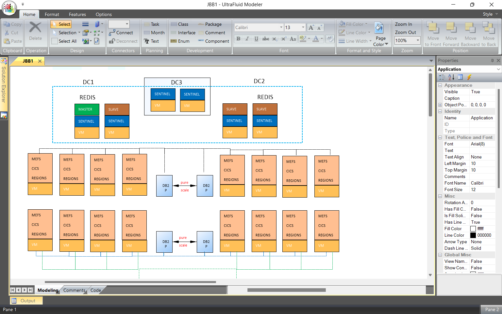

Overview:
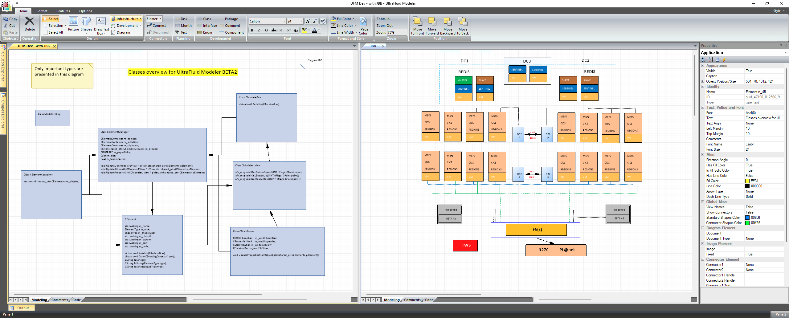
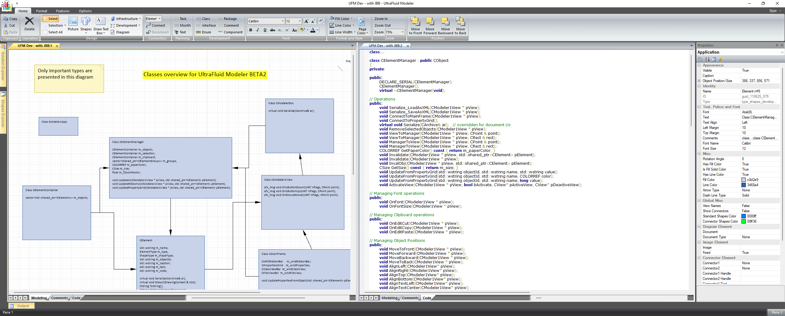
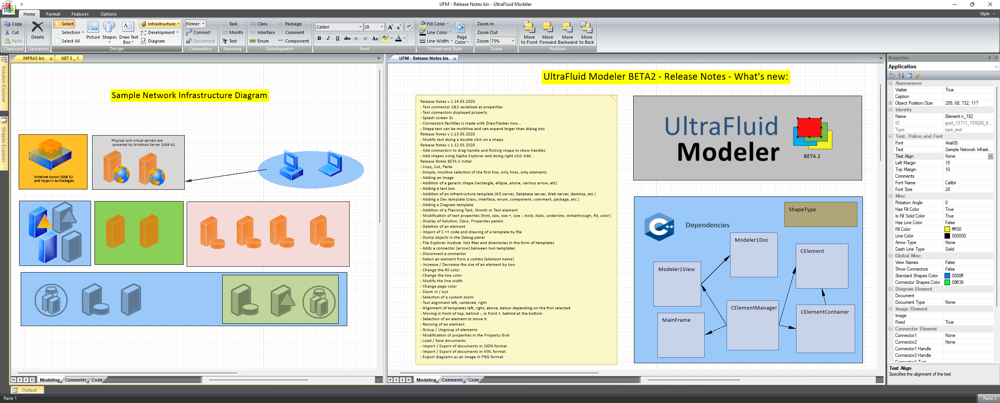
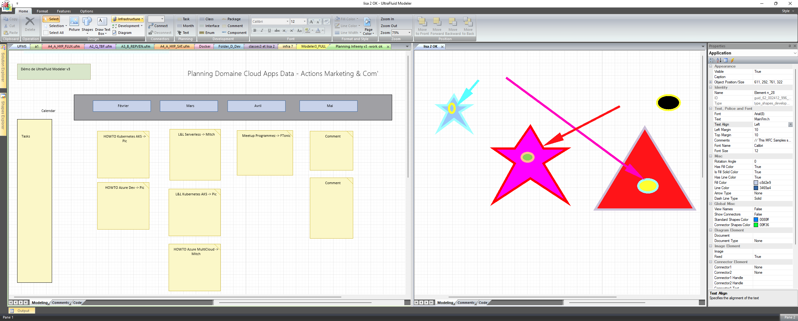

Ribbon overview:
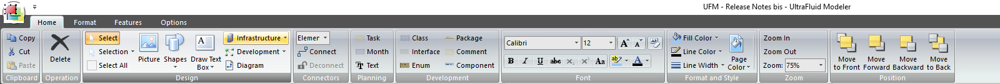
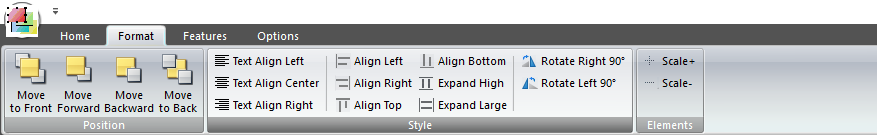
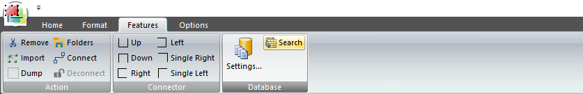
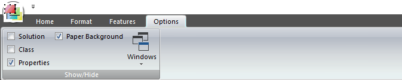

Ribbon features:
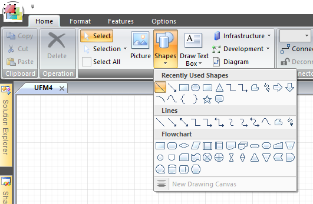
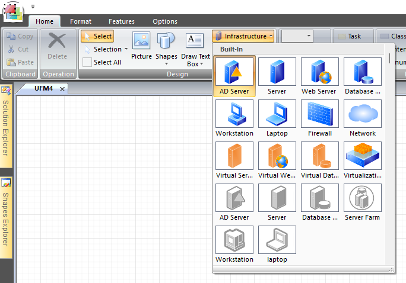
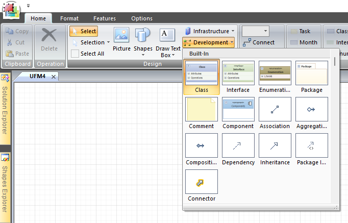

