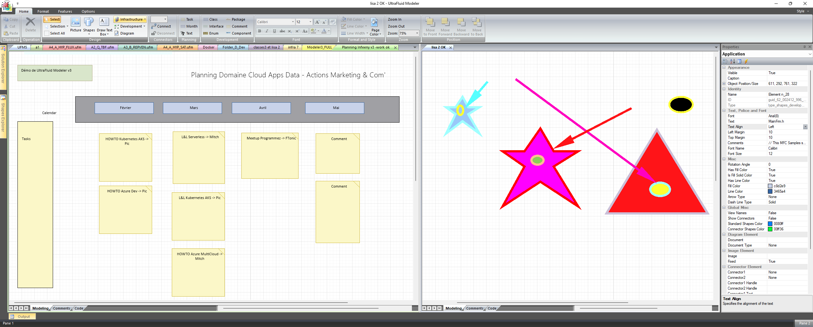

# UltraFluidModelerNET

UltraFluidModelerNET is my open-source contribution for the Microsoft MVP program (mvp.microsoft.com)

Christophe Pichaud - christophep@cpixxi.com

Overview:

Ribbon overview:

Ribbon features:

